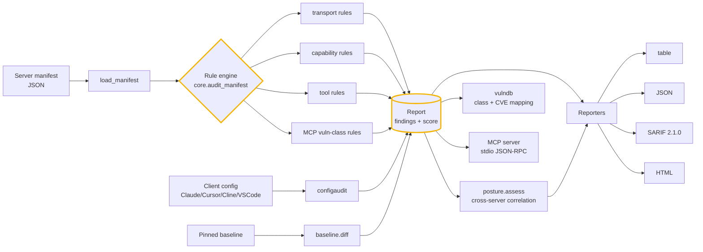
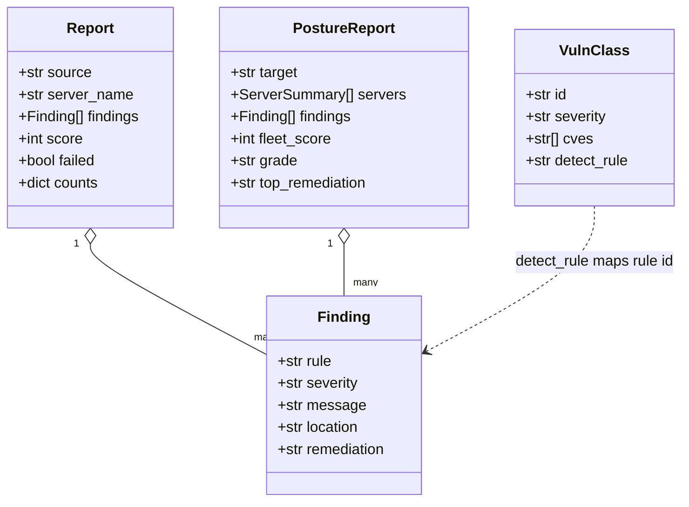

# Architecture

`mcpharden` is an offline static linter for the Model Context Protocol attack
surface. It consumes the descriptors an MCP deployment already produces — server
manifests, client configs, and pinned baselines — applies a rule set spanning
transport, capabilities, and tooling, maps each finding to a documented MCP
vulnerability class, and renders the result in the format your workflow speaks.
No network, no exploit code: everything is computed locally from the inputs.

## The pipeline

## Components

### Rule engine (`mcpharden/core.py`)
The heart of the linter. `audit_manifest` runs five rule families over a parsed
manifest and returns a `Report` (a list of `Finding`s plus a 0–100 hardening
`score` and a `failed` flag that trips on any critical/high finding):

- **transport** — `_check_transport` normalizes the many real spellings of
  `transport` (object or bare string, with sibling `host`/`tls`/`auth` keys) into
  one shape, then flags bind-all, missing TLS, missing auth, wildcard origins, and
  malformed/undeclared transports.
- **capability** — `_check_capabilities` catches the declared-vs-actual mismatch
  (tools exposed but `capabilities.tools` not advertised), empty advertisements,
  and experimental capabilities.
- **tooling** — `_check_tools` checks each tool for a name, a real description,
  duplicate names, prompt-injection text, an `inputSchema` on side-effecting
  ("dangerous-verb") tools, confirmation gating, and open schemas.
- **secrets** — `_check_secrets` scans the raw manifest text for embedded
  credentials (token prefixes such as `sk_live_`, `ghp_`, `AKIA…`, JWTs, and
  `key=value` shapes).
- **MCP vuln classes** — `_check_mcp_vuln_classes` covers the 2025–2026 attack
  surface: line-jumping control chars, cross-server shadowing, shell-exec/RCE,
  mutable (rug-pull) registration, token passthrough, OAuth/session-in-URL,
  SSE/HTTP CORS DNS-rebinding, auto-approval, unpinned launch commands, and
  unbounded sampling.

### Client-config audit (`mcpharden/configaudit.py`)
The riskiest real surface isn't an abstract manifest — it's the `mcpServers`
block in a Claude Desktop / Cursor / Cline / Windsurf / VS Code config.
`audit_config` parses every known config shape and flags unpinned `npx`/`uvx`
launchers, secrets hard-coded in `env`, `sh -c` command lines, cleartext/no-auth
remote servers, and blanket auto-approve lists.

### Baseline / rug-pull diff (`mcpharden/baseline.py`)
`build_baseline` pins a SHA-256 of each tool's `name + description + inputSchema`
when a server is trusted; `diff_baseline` re-hashes a later manifest and flags any
tool that was **added, removed, or mutated** — the rug-pull signature
(CVE-2025-54136 / MCP-RP-01).

### Fleet posture (`mcpharden/posture.py`)
`assess` summarizes every manifest in a directory, then runs cross-server
correlators that find risks split across manifests and therefore invisible to a
per-server audit: reused credentials, tool-name collisions, RCE-next-to-exposed
lateral movement, trust-tier/TLS inconsistency, and failure concentration. It
rolls the fleet up to one 0–100 score, an A–F grade, and the single
highest-leverage fix.

### Vulnerability catalog (`mcpharden/vulndb.py`)
A curated, data-only taxonomy of every well-documented MCP attack class through
2026, each tied to real CVEs / advisories. `BY_RULE` maps a core rule id back to
its catalog entry so every finding links to a named class and its references.

### Reporters (`mcpharden/core.py`)
`Report.to_dict` (JSON), `to_sarif` (SARIF 2.1.0 for GitHub code-scanning),
`to_html` (a shareable page), and the CLI's table renderer. The posture report has
its own table/HTML renderers in `posture.py`.

### CLI + MCP server (`mcpharden/cli.py`, `mcpharden/mcp_server.py`)
`cli.main` dispatches `audit`, `scan`, `configscan`, `baseline`, `diff`,
`posture`, `rules`, `vulndb`, and `mcp`. The exit code is the CI gate: non-zero
when a finding at or above `--fail-on` is present. `mcp_server` exposes the same
engine to agents over stdio JSON-RPC.

## Data model

## Why these choices

- **Static and offline.** Every input is a descriptor the deployment already
  has; nothing is fetched, executed, or sent to a vendor. The linter is safe to
  run in CI and against configs you don't control.
- **One Finding model.** Manifest, config, baseline, and posture findings all use
  the same `Finding`/`Report` shape, so they merge into one report and one exit
  code, and forward cleanly to `cognis-connect` (STIX/MISP/Sigma/Splunk/Slack).
- **Findings link to the literature.** `vulndb` is the bridge from a rule id to a
  named class and the CVE behind it, so a finding is auditable, not just an alert.

## Extending

Detections/rules live in `mcpharden/` next to `core.py`. Add a rule, add a test in
`tests/`, and (optionally) add a bundled sample manifest under `demos/fixtures/`
plus a scenario so the behavior is covered by the runnable demos. See
[CONTRIBUTING.md](../CONTRIBUTING.md) and [DEMOS.md](DEMOS.md).
