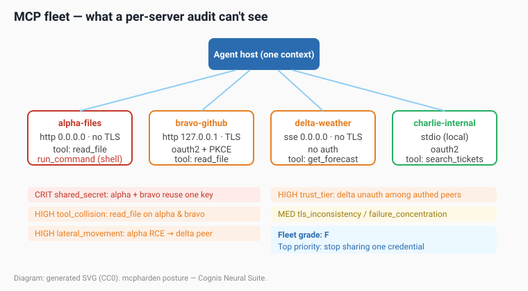

# Fleet posture — cross-server MCP correlation

> `mcpharden posture <dir>` — the risks that only exist *between* MCP servers.



*Diagram: generated SVG, released CC0. No third-party imagery.*

## Why a per-server audit is not enough

`mcpharden audit` / `scan` answer one question per manifest: **is *this* MCP
server hardened?** That is necessary but not sufficient, because almost nobody
runs one MCP server. A real agent host — Claude Desktop, Cursor, Cline, or an
autonomous agent — connects to a **fleet** of servers that share *one model
context* and *one trust boundary*. The agent reads every tool description from
every server into the same prompt, and routes tool calls by name across all of
them.

That shared context creates whole classes of risk that are **structurally
invisible** to a per-manifest audit, because the evidence is split across files:

| Correlation rule | Severity | What it catches | Why per-server scanning misses it |
|---|---|---|---|
| `fleet.shared_secret` | critical | The same embedded credential in ≥2 manifests | Each copy looks like one local secret-exposure finding; nothing links them |
| `fleet.tool_collision` | high | One tool name (`read_file`, `search`) registered by ≥2 servers | Each server has exactly one `read_file` — locally unambiguous |
| `fleet.lateral_movement` | high | An RCE-prone server co-resident with a network-reachable, under-protected peer | RCE and exposure live in *different* manifests |
| `fleet.trust_tier_inconsistency` | high | Some network servers require auth, peers don't | A single weak peer is "just one finding" until you see the fleet |
| `fleet.tls_inconsistency` | medium | Cleartext network peer among TLS peers | Same — only visible across files |
| `fleet.failure_concentration` | medium | ≥50% (and ≥2) of servers fail their own audit | Aggregate, not per-file |

Everything is computed locally from the same manifests `scan` already parses.
**No network, no exploit code, no fabricated data** — secret values are
fingerprinted (`sk_liv…78`), never printed in full, and obvious placeholders
(`YOUR_TOKEN_HERE`, `example`, `changeme`) are ignored so a fleet of demo
manifests is not falsely flagged.

## Threat model (frank and technical)

The MCP trust boundary is the *model context*, not the process. The moment two
servers feed tool metadata into one agent, three things become attacker-useful:

1. **Name routing is content-addressed by the LLM, not the runtime.** If
   `read_file` exists on both a trusted GitHub server and an attacker-controlled
   file server, the model decides which one to call from descriptions it was told
   to trust. This is the precondition for **cross-server tool shadowing**
   (Invariant Labs) and confused-deputy routing — `fleet.tool_collision`
   surfaces every ambiguous name before an attacker exploits it.

2. **Blast radius follows shared credentials.** Reusing one API key across
   servers means compromising the *weakest* server (say, an unpinned `npx`
   launcher — supply-chain RCE) leaks a credential that authorizes the
   *strongest* one. `fleet.shared_secret` makes the blast radius explicit and
   tells you rotation now requires touching every server.

3. **Lateral movement is a fleet property.** A shell-exec tool
   (`tool.shell_exec`, RCE on its host) is dangerous alone; co-resident with a
   `0.0.0.0`/no-auth peer it becomes a *pivot* — land code on host A, reach the
   exposed MCP port on host B. `fleet.lateral_movement` is the only rule in the
   tool that reasons about two manifests at once to flag this.

This is strictly **defensive**: detection, scoring, and prioritized
remediation. There is no exploit generation, no targeting, nothing that acts on
a host. It tells an operator what to fix first.

## Walkthrough — a real (synthetic) deployment

The repo ships a deliberately-vulnerable fleet under
`tests/fixtures/fleet/` (four servers) and a clean one under
`tests/fixtures/clean_fleet/`. Run posture on the dirty fleet:

```bash
mcpharden posture tests/fixtures/fleet
```

```
MCPHARDEN fleet posture — tests/fixtures/fleet
========================================================================
4 server(s), 3 network-reachable.  Fleet score: 0/100  (grade F)
------------------------------------------------------------------------
  [FAIL]   0/100  net   http           alpha-files
  [FAIL]  20/100  net   sse            delta-weather
  [FAIL]  60/100  net   http           bravo-github
  [PASS] 100/100  local stdio          charlie-internal
------------------------------------------------------------------------
CROSS-SERVER CORRELATIONS (6):
[CRIT] fleet.shared_secret
        The same embedded credential (sk_liv…78) appears in 2 manifests
        (alpha-files, bravo-github); compromise of any one server exposes a
        credential whose blast radius is the whole fleet ...
[HIGH] fleet.lateral_movement   ...
[HIGH] fleet.tool_collision     read_file on alpha-files, bravo-github ...
[HIGH] fleet.trust_tier_inconsistency  delta-weather has no auth ...
[MED ] fleet.failure_concentration     3/4 servers (75%) fail ...
[MED ] fleet.tls_inconsistency  ...
========================================================================
TOP PRIORITY: Move the credential to a per-server secret store ...
RESULT: FAIL
```

`charlie-internal` passes its own audit and would be invisible in a triage
sorted by per-server score — yet the fleet is graded **F** because of risks
that span the other three.

### Output formats and CI gates

```bash
mcpharden posture ./mcp-servers --format json --out posture.json
mcpharden posture ./mcp-servers --format html --out posture.html   # shareable report

# Fail CI when any high-or-worse cross-server risk exists:
mcpharden posture ./mcp-servers --fail-on high

# Or gate on an overall letter grade:
mcpharden posture ./mcp-servers --min-grade B
echo $?   # non-zero if the fleet grades below B
```

The JSON object is stable: `fleet_score`, `grade`, `server_count`,
`network_count`, `top_remediation`, a `servers[]` rollup, and a
`correlations[]` array of findings (each with `rule`, `severity`, `message`,
`location`, `remediation`).

### Over MCP

`posture` is also exposed as an MCP tool, so an agent can self-assess the very
fleet it is connected to:

```jsonc
{"method":"tools/call","params":{"name":"posture","arguments":{"target":"./mcp-servers"}}}
```

The result's `isError` is `true` when the fleet has a critical/high
correlation finding.

## Remediation priorities (in order)

1. **Stop sharing credentials.** One least-privilege, independently-rotatable
   token per server.
2. **Namespace tools.** Prefix tool names by server, or remove duplicate
   registrations, so every name resolves to exactly one implementation.
3. **Isolate RCE-capable servers** onto their own host/network namespace and put
   auth + TLS on every network transport (bind to `127.0.0.1`).
4. **Make the trust tier uniform.** There is no benefit to hardening some
   network peers and not others — the weakest reachable one is the entry point.
5. **Run posture in CI** with `--min-grade` so new servers are gated before they
   join the fleet.

## Provenance

The vulnerability classes referenced here are real and documented: Invariant
Labs tool-poisoning/shadowing research, the OWASP MCP Security Cheat Sheet, and
the CVEs catalogued by `mcpharden vulndb`. The fixtures are clearly synthetic
(obvious test tokens). The diagram is a generated SVG released CC0.
